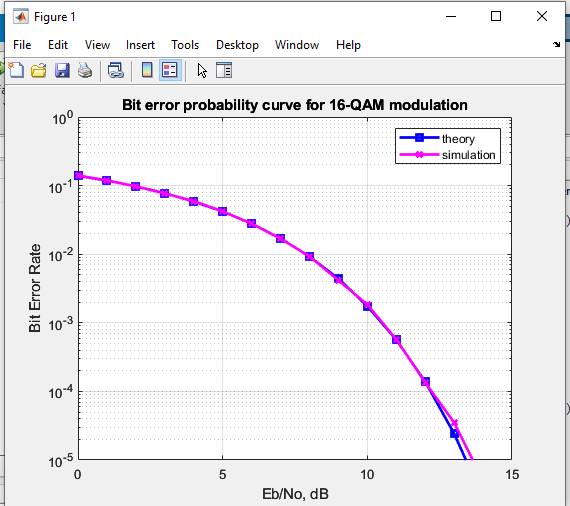
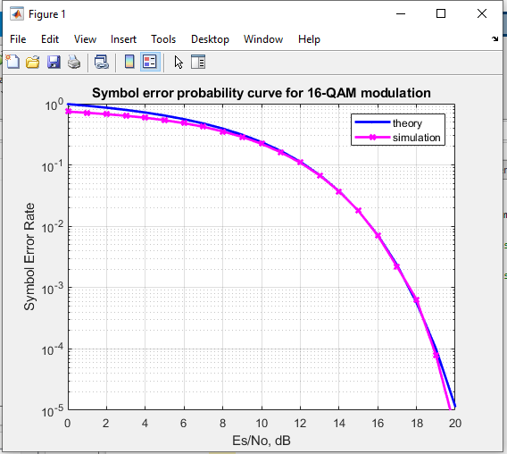

# Evaluating-BER-SER-16QAM-RF-AWGN
Mô phỏng hệ thống OFDM sử dụng bộ lọc Zero forcing trên kênh truyền Rayleigh nhiễu trắng, điều chế 16 QAM. Đánh giá chất lượng của BER, SER

## Sử dụng matlab để mô phỏng
Tất cả các code của đề tài nằm ở thư mục Matlab

# Hình ảnh kết quả
**Bit error probability curve for 16-QAM modulation**   
  
**Symbol error probability curve for 16-QAM modulation**    
  

# Công việc còn lại 
- [ ] Tìm hiểu các công thức ở trong các file code 
- [ ] Thiết kế lại giao diện để chỉnh sửa các thông số của code  
- [ ] Viết báo cáo và tóm tắt

# References
- https://dsplog.com/2012/01/01/symbol-error-rate-16qam-64qam-256qam/
- https://dsplog.com/2008/06/05/16qam-bit-error-gray-mapping/
